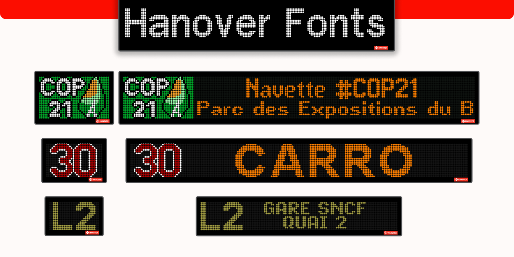

<div align="center">



Télécharger les polices
<!-- BEGIN LATEST DOWNLOAD BUTTON -->
<!-- END LATEST DOWNLOAD BUTTON -->

</div>


# Hanover fonts

Polices Hanover des familles EUROFONTS, POLICES, RATP, KEOLIS, Transdev, et Île-de-France Mobilités, incluant les polices pour les fonds de couleurs et des fonds de base pour les girouettes de toutes tailles.

Ces polices sont conçues de sorte que les points aient tous la même taille.

Note : Pour la police "Hanover Colour RN", certaines déclinaisons avec la diagonale ne sont pas correctes. Elles seront corrigées dans une version future.

## Fonctionnement

__**Note générale**__ : Le nombre indiqué dans le nom des polices correspond à la hauteur maximale des caractères. Pour les polices EUROFONTS, seuls les deux premiers chiffres indiquent cette hauteur. Veillez à ce que la taille des cercles (LED) soit cohérente entre toutes les polices utilisées sur une même girouette, et n'utilisez pas une police inadaptée. 
Des explications plus détaillées sont disponibles dans les manuels.

### Girouette sans couleur :
1. Accédez au dossier "signes_background/" et sélectionnez un sous-dossier. Le plus couramment utilisé est "externally_viewed_mono_led_signs".
2. Une fois la variante choisie, rendez-vous dans le dossier "backgrounds/_guide" et ouvrez une image de référence dans votre logiciel de dessin.
3. Il est conseillé de commencer par l'indice de ligne. Choisissez votre police et ajustez sa taille jusqu'à ce que les points de la police s'alignent parfaitement avec ceux du fond.
4. Une fois l'indice de ligne positionné, dupliquez le texte et appliquez une autre police sans modifier la taille. Il est crucial de conserver la même taille de points sur l'ensemble de la girouette.

### Girouette avec couleurs :
1. Accédez au dossier "signes_background/" et sélectionnez un sous-dossier. Le plus couramment utilisé est "color_rn_multicolour_route_number_signs".
2. Une fois la variante choisie, rendez-vous dans le dossier "backgrounds/_guide" et ouvrez une image de référence dans votre logiciel.
3. Commencez par l'indice de ligne. Pour créer le fond coloré de l'indice, utilisez la police "Hanover Colour RN" et sélectionnez la variante correspondant à la taille de la girouette. Saisissez la lettre "a" pour un fond normal, ou la lettre "b" pour un fond avec une diagonale.
4. Dupliquez ensuite ce texte et appliquez une autre police sans modifier la taille. Il est crucial de conserver la même taille de points sur l'ensemble de la girouette.

Effet de contour :
- Mettez le texte en gras. Si cela ne fonctionne pas, sélectionnez manuellement la variante "Bold" de la police.
- Saisissez le texte souhaité en noir ou dans une couleur sombre.
- Dupliquez ce texte, appliquez la variante "Regular" (version standard) de la police, et changez la couleur pour celle souhaitée.

De plus voici une vidéo sur la création de griouettes avec ces polices sur PixelLab : [https://www.youtube.com/watch?v=O_4FYt-wAvs](https://www.youtube.com/watch?v=O_4FYt-wAvs)

## Caractères spéciaux

### Hanover Colour RN

- Fond plein : a
- Fond ayant une diagonale : b

### Autre

Voir la documentation dans le dossier `docs`.

Voici une proposition d'amélioration de votre documentation. Le texte a été restructuré pour être plus clair, plus professionnel et plus facile à suivre (idéalement pour un fichier `README.md`). 

Les fautes de frappe (comme "parant") ont été corrigées, et la formule mathématique a été déplacée juste à côté des variables JSON auxquelles elle se rapporte pour une meilleure logique.

## Guide développeur

### Prérequis

- Python : version 3.13 (ou supérieure)
- Pillow : `pip install pillow`

### Extraction des caractères

1. Créez un dossier principal contenant un sous-dossier pour chaque police.
2. Placez le fichier `.fnt` correspondant dans chaque sous-dossier.
3. Lancez le script `extract_fnt_glyph.py` en modifiant la variable `ROOT_DIR` dans le script vers le chemin du dossier principal.
   > Note pour les utilisateurs Windows : Assurez-vous d'utiliser des slashs (`/`) plutôt que des antislashs (`\`) dans vos chemins.

### Configuration des polices

Le script génère des fichiers `.json` pour chaque police. Il est fortement recommandé de les vérifier et de les modifier manuellement, car les fichiers `.fnt` d'origine ne contiennent souvent pas les bonnes valeurs pour l'espacement des lettres et la taille de l'espace.

Voici la structure d'un fichier de configuration `.json` :

```json
{
  "font_name": "Font name",
  "space_pixels": 3,
  "inter_char_space_pixels": 1
}
```

### Génération des fichiers OTF

Une fois les fichiers bitmap extraits et les fichiers `.json` configurés, ouvrez le script `generate_otf_from_bitmaps.py` et modifiez les variables suivantes en début de fichier :

- `ROOT_FOLDER` : Le chemin vers votre dossier principal
- `FONT_FAMILY` : Le nom de la famille de polices (nom parent)
- `EXPORT_FOLDER` : Le dossier de destination pour les fichiers `.otf` générés
- `MASTER_MAX_HEIGHT` : La hauteur maximale (en pixels) de la police

## Note

Ce dépôt est dédié à la préservation numérique et à l'expérimentation technique. Le travail réalisé ici consiste en l'extraction de polices depuis des logiciels existants, leur conversion depuis des fichiers `.fnt` vers des bitmaps, puis leur reconstruction en fichiers `.otf`/`.ttf` utilisables, tout en conservant un format spécifique.
Les fichiers `.fnt` originaux sont conservés dans ce dépôt à des fins d'archivage et de référence technique. 

Ce projet est une initiative non officielle, réalisée par passion. Il n'est ni affilié, ni soutenu, ni approuvé par Hanover Displays, la RATP, KEOLIS, Transdev ou Île-de-France Mobilités. Toutes les marques, designs et droits de propriété intellectuelle originaux appartiennent à leurs propriétaires respectifs. Ce contenu est fourni à des fins éducatives et de préservation uniquement.

## Licence

Afin de respecter à la fois l'esprit de partage de ce projet et les droits des créateurs originaux, ce dépôt distingue deux catégories de fichiers :

### 1. Le projet technique, les scripts et les polices recréées (OTF/TTF)

Les fichiers de polices recréés (`.otf` / `.ttf`) sont placés sous licence [CC0 1.0 Universal (CC0 1.0) - Domaine Public](https://creativecommons.org/publicdomain/zero/1.0/deed.fr). 
Vous êtes libre de copier, modifier, distribuer et utiliser ces fichiers recréés, même à des fins commerciales, sans aucune condition.

### 2. Les fichiers sources originaux (.fnt)

Les fichiers `.fnt` inclus dans ce dépôt à des fins d'archivage, de référence technique et de préservation ne sont pas sous licence CC0. 
Ils restent la propriété intellectuelle exclusive de leurs créateurs originaux (Hanover Displays, RATP, KEOLIS, Transdev, Île-de-France Mobilités). Ils sont hébergés ici uniquement dans un cadre non-officiel de préservation numérique et d'expérimentation technique. Ce projet n'est ni affilié, ni soutenu par ces entités.
